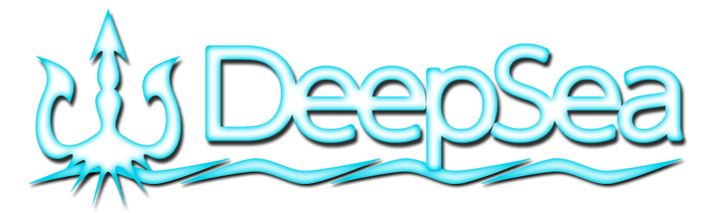

    The new All-in-One CFW package for the Nintendo Switch. 
     
    
    

---

## Features

- Background FTP server for filetransfers
- Install NSP, NSZ, XCI & XCZ files from Harddrive, Google Drive, WLAN or wired through PC, Smartphone, etc
- Over & Underclocking
- Update OFW & CFW through homebrew
- Find new homebrew through the Appstore
- Savegame management
- Cheating in games (please don't cheat online)
- Emulate Amiibo
- Use all kinds of 3rd party controllers
- Lan play (like Hamachi for your Switch)
- Tesla overlay to control all those features (press L1+DpadDown+RightStick)

**Please check out our [wiki](https://github.com/Team-Neptune/DeepSea/wiki) to learn about the best features**

## How to use
Follow this guide to hack your Switch: https://switch.homebrew.guide

Download the latest release and put it on your SD Card 
Send the Hekate payload to your Switch in RCM mode and launch the CFW

## Featuring

| Software | Advanced Package| Normal Package | Minimal Package |
| -------- | :-------------: | :------------: | :------------: |
| [AIO-switch-updater](https://github.com/HamletDuFromage/aio-switch-updater) | ✅ | ✅ |  |
| [Atmosphère](https://github.com/Atmosphere-NX/Atmosphere) | ✅ | ✅ | ✅ |
| [DeepSea Assets](https://github.com/Team-Neptune/DeepSea-Assets) | ✅ | ✅ | ✅ |
| [DeepSea Cleaner](https://github.com/Team-Neptune/DeepSea-Cleaner) | ✅ | ✅ |  |
| [DeepSea CPR](https://github.com/Team-Neptune/CommonProblemResolver) | ✅ | ✅ |  |
| [DeepSea Toolbox](https://github.com/Team-Neptune/DeepSea-Toolbox) | ✅ | ✅ |  |
| [EdiZon-SE](https://github.com/tomvita/EdiZon-SE) | ✅ | ✅ |  |
| [EdiZon-Overlay](https://github.com/proferabg/EdiZon-Overlay) | ✅ | ✅ |  |
| [Emuiibo](https://github.com/XorTroll/emuiibo) | ✅ | ✅ |  |
| [Hekate](https://github.com/CTCaer/hekate) | ✅ | ✅ | ✅ |
| [Homebrew App Store](https://gitlab.com/4TU/hb-appstore) | ✅ | ✅ | ✅ |
| [JKSV](https://github.com/J-D-K/JKSV) | ✅ | ✅ |  |
| [ldn_mitm](https://github.com/spacemeowx2/ldn_mitm) | ✅ |  |  |
| [MissionControl](https://github.com/ndeadly/MissionControl) | ✅ |  |  |
| [nx-ovlloader](https://github.com/WerWolv/nx-ovlloader) | ✅ | ✅ |  |
| [NX-Shell](https://github.com/joel16/NX-Shell) | ✅ |  |  |
| [nxmtp](https://github.com/liuervehc/nxmtp) | ✅ | ✅ |  |
| [ovlSysmodules](https://github.com/WerWolv/ovl-sysmodules) | ✅ | ✅ |  |
| [Status Monitor Overlay](https://github.com/masagrator/Status-Monitor-Overlay) | ✅ |  |
| [sys-clk](https://github.com/retronx-team/sys-clk) | ✅ |  |
| [sys-con](https://github.com/cathery/sys-con) | ✅ |  |  |
| [sys-ftpd-light](https://github.com/cathery/sys-ftpd-light) | ✅ | ✅ |  |
| [TegraExplorer](https://github.com/joel16/NX-Shell) | ✅ |  |  |
| [Tesla-Menu](https://github.com/WerWolv/Tesla-Menu) | ✅ | ✅ |  |
| [TinWoo](https://github.com/mrdude2478/TinWoo) | ✅ | ✅ |  |

## Credits
* Thanks to all the previous members of Team AtlasNX for laying the groundwork for DeepSea.
* And a huge thanks to all the awesome homebrew developers!
